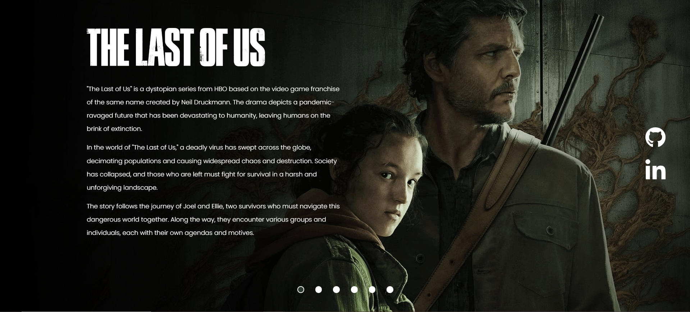

# The Last of Us TV Series Landing Page

This landing page was developed during a ["Dev em Dobro"](https://devemdobro.com/matriculas-abertas/) event as a way to teach HTML, CSS, and JavaScript. It is a landing page for the TV series "The Last of Us" based on the video game franchise of the same name created by Neil Druckmann.

## Screenshots
To go to the landing page, click [here](https://haushinka56.github.io/the-last-of-us/)

## Technologies Used

- HTML
- CSS
- JavaScript
- ChatGPT

## Features

- Carousel of images from "The Last of Us" TV series
- Information about the TV series and its storyline
- Social media icons linking to the developer's GitHub and LinkedIn profiles

## License

This project is licensed under the [MIT License](LICENSE).
